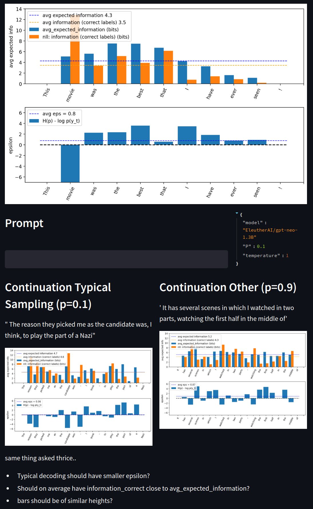

# Typical Decoding for Natural Language Generation

* Clara Meister, Tiago Pimentel, Gian Wiher and Ryan Cotterell, 2022 
    * [Paper arxiv](https://arxiv.org/pdf/2202.00666.pdf)
    * [Paper pdf](https://arxiv.org/pdf/2202.00666.pdf)


* Install dependencies (look in `requirements.txt`)
* Run [streamlit](https://streamlit.io/) interface 

  ```bash
  streamlit run typical_decoding_interface.py
  ```

-----



